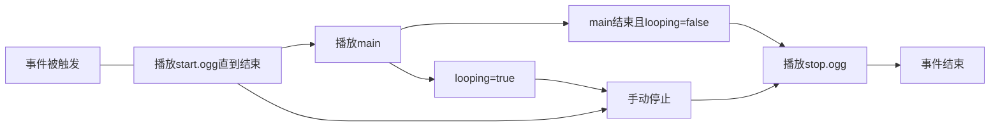

在触发某些事件时，IR会播放一些默认音效。你可以在对应车辆的json内覆写它们。

### 你需要在与`properties`并列的层级内添加它们(例)：

```json
{
     "sound": {
       "wheels":"RL",
       
       "flange":"RL",
       "flange_min_yaw":0.2,
       
       "bell":{
         "main":"RL",
         "stop":"RL"
       }
     }
}
```

对于音效，有如下关键字定义。它们都是可缺省的(尽管这没什么必要)：

|       关键字        |        类型        |           含义            |
|:----------------:|:----------------:|:-----------------------:|
|     `wheels`     | ResourceLocation |      车辆在轨道上运动时循环播放      |
|     `clack`      | ResourceLocation |       轮对通过轨道接缝时播放       |
|  `clack_front`   | ResourceLocation | 前轮对通过轨道接缝时播放(覆盖`clack`) |
|   `clack_rear`   | ResourceLocation | 后轮对通过轨道接缝时播放(覆盖`clack`) |
|     `couple`     | ResourceLocation |         车钩连接时播放         |
|    `sliding`     | ResourceLocation |      车辆刹车时播放的轮轨滑动音      |
|     `flange`     | ResourceLocation |         法兰？我不理解         |
| `flange_min_yaw` |      float       |         Cam不理解          |
|   `collision`    | ResourceLocation |        车辆发生碰撞时播放        |

>[!NOTE]
> 这里的`ResourceLocation`只需包含路径部分，无需包含`immersiverailroading:`。

对于内燃机车，有这些额外定义：

|       关键字        |        类型        |           含义            |
|:----------------:|:----------------:|:-----------------------:|
|     `wheels`     | ResourceLocation |      车辆在轨道上运动时循环播放      |
|     `clack`      | ResourceLocation |       轮对通过轨道接缝时播放       |
|  `clack_front`   | ResourceLocation | 前轮对通过轨道接缝时播放(覆盖`clack`) |
|   `clack_rear`   | ResourceLocation | 后轮对通过轨道接缝时播放(覆盖`clack`) |
|     `couple`     | ResourceLocation |         车钩连接时播放         |
|    `sliding`     | ResourceLocation |      车辆刹车时播放的轮轨滑动音      |
|     `flange`     | ResourceLocation |         法兰？我不理解         |
| `flange_min_yaw` |      float       |         Cam不理解          |
|   `collision`    | ResourceLocation |        车辆发生碰撞时播放        |

你还可以定义每个音效的内容，就像样例中的`bell`一样，它们都是可缺省的：

|    关键字     |        类型        |          含义           |
|:----------:|:----------------:|:---------------------:|
|  `start`   | ResourceLocation |        事件触发时播放        |
|   `main`   | ResourceLocation |     `start`结束后播放      |
|   `stop`   | ResourceLocation |   `main`结束或手动关闭时播放    |
| `looping`  |     boolean      |    `main`部分是否循环播放     |
| `distance` |      float       |      玩家可在多远处听到声音      |
|  `volume`  |      float       |         音量系数          |




独立定义的音效默认对应`main`。
