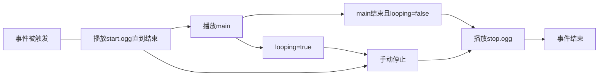

在触发某些事件时，IR会播放一些默认音效。你可以在对应车辆的json内覆写它们。

>[!NOTE]
> IR的音效并不会随距离衰减。

### 你需要在与`properties`并列的层级内添加它们(例)：

```json
{
     "sound": {
       "wheels":"RL",
       
       "flange":"RL",
       "flange_min_yaw":0.2,
       
       "bell":{
         "main":"RL",
         "stop":"RL"
       }
     }
}
```

对于音效，有如下关键字定义。它们都是可缺省的(尽管这没什么必要)：

|       关键字        |        类型        |                含义                |
|:----------------:|:----------------:|:--------------------------------:|
|     `wheels`     | ResourceLocation |          车辆在轨道上运动时循环播放           |
|     `clack`      | ResourceLocation |           轮对通过轨道接缝时播放            |
|  `clack_front`   | ResourceLocation |     前轮对通过轨道接缝时播放(覆盖`clack`)      |
|   `clack_rear`   | ResourceLocation |     后轮对通过轨道接缝时播放(覆盖`clack`)      |
|     `couple`     | ResourceLocation |             车钩连接时播放              |
|    `sliding`     | ResourceLocation |          车辆刹车时播放的轮轨滑动音           |
|     `flange`     | ResourceLocation |        当车辆通过弯道，即发生轮缘摩擦时播放        |
| `flange_min_yaw` |      float       | 描述`flange`音效触发时车辆通过的最小曲线弯度，默认2.5 |
|   `collision`    | ResourceLocation |            车辆发生碰撞时播放             |

* 轮缘摩擦音效播放条件挺复杂，需要车辆速度大于5km/h且：车辆前转向架相对于车体的偏航角与(后转向架相对于车体的偏航角/两转向架间距)大于
  (`flange_min_yaw`/当前速度的算术平方根*根号5)
* 或许可以当作最小转弯半径警告音？至少我不喜欢听这个。

>[!NOTE]
> 这里的`ResourceLocation`只需包含路径部分，无需包含`immersiverailroading:`。

对于内燃机车，有这些额外定义：

|          关键字          |        类型        |                        含义                        |
|:---------------------:|:----------------:|:------------------------------------------------:|
|        `idle`         | ResourceLocation |                     车辆怠速时播放                      |
|       `running`       | ResourceLocation |                     车辆运行时播放                      |
|        `horn`         | ResourceLocation | 车辆[鸣笛](https://www.mcmod.cn/item/780406.html)时播放 |
|        `bell`         | ResourceLocation | 车辆[响铃](https://www.mcmod.cn/item/780407.html)时播放 |


对于蒸汽机车，有这些额外定义：

|       关键字        |         类型         |     含义     |
|:----------------:|:------------------:|:----------:|
|      `idle`      |  ResourceLocation  |     同上     |
|      `bell`      |  ResourceLocation  |     同上     |
|     `chuff`      |  ResourceLocation  | 车辆连杆转一圈播一次 |
|    `pressure`    |  ResourceLocation  |    不晓得     |
| `cylinder_drain` |  ResourceLocation  |  气缸泄压时播放   |
|    `whistle`     |  ResourceLocation  |  同`horn`   |

对于一些控件，你还可以分别定义其声音，就像这样：

```json
{
      "sound": {
          ...,
          "controls": {
              "READOUT": {
                  "engage": "RL",
                  "move": "RL",
                  "movePercent": 0.45,
                  "disengage": "RL"
              }
          }
      }
     
}
```

|      关键字      |        类型        |                 含义                 |
|:-------------:|:----------------:|:----------------------------------:|
|   `engage`    | ResourceLocation |             玩家按下控件时播放              |
|    `move`     | ResourceLocation |             玩家操控控件途中播放             |
| `movePercent` |      float       | 在播放move前，控件的动画变量需要至少改变多少？与`move`共存 |
|  `disengage`  | ResourceLocation |             玩家松开控件时播放              |

你可以在`controls`里添加你想加音效的部件，填入它们的**原始**READOUT即可。Cam的例子是对于`k4_REVERSER_1_Cube`，填`REVERSER_1`。

对于所有音效，比起直接填入RL，你还可以定义它们的内容，就像上文样例中的`bell`一样。它们都是可缺省的：

|    关键字     |        类型        |        含义        |
|:----------:|:----------------:|:----------------:|
|  `start`   | ResourceLocation |     事件触发时播放      |
|   `main`   | ResourceLocation |   `start`结束后播放   |
|   `stop`   | ResourceLocation | `main`结束或手动关闭时播放 |
| `looping`  |     boolean      |  `main`部分是否循环播放  |
| `distance` |      float       |  玩家最远可在多远处听到声音   |
|  `volume`  |      float       |       音量系数       |




独立定义的音效默认对应`main`。
