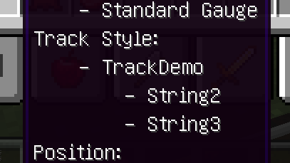

# JSON

>[!ATTENTION]
>每个轨道的JSON名都不应相同，即使它们分属不同的资源包。尽管这样可以加载，但会导致不可预见的情况发生。


IR通过`assets/immersiverailroading/track`中的`track.json`文件识别轨道。该文件格式如下：
```JSON
{
	"types" : [
	"name1",
	"name2" 
  ]
}
```
定义更多的轨道则为在`"types"`中继续添加字符串。

IR而后会在`assets/immersiverailroading/track`中寻找对应名称的JSON，在本示例中为`name1.json`和`name2.json`。

这些JSON内容应该像这样：
```JSON
{
    "name": "TrackDemo",
    "modeler": "String2",
    "pack": "String3",
    "models": {
        ">1": "immersiverailroading:models/abcd.obj",
        ">0": "immersiverailroading:models/abc.obj"
    },
    "model_gauge_m": 1.435,
    "model_spacing_m": 1,
    "clack": true,
    "cog": false,
    "materials": {
      "TIE": [
          {
              "item": "ore:ingotIron",
              "cost": 1
          },
          {
              "item": "ore:stone",
              "cost": 2
          }
      ],
      "BED": [
        {
          "item": "ore:gravel",
          "cost": 3
        }
      ],
      "RAIL": [
          {
              "item": "ore:ingotIron",
              "cost": 1
          }
        ]
    }
}
```

|   名称    |   类型   |                   	含义                   |
|:-------:|:------:|:---------------------------------------:|
|  name   | String | 游戏内显示的轨道名，**缺省会导致NullPointerException** |
| modeler | String |            游戏内显示的作者名，如缺省则不显示            |
|  pack   | String |           游戏内显示的资源包名，如缺省则不显示            |

对于案例来说显示为这样：



|       名称        |                类型                 |                          	含义                           |
|:---------------:|:---------------------------------:|:------------------------------------------------------:|
|     models      |   无序集合（String，ResourceLocation）   | 当轨距满足前一部分表达式的条件时，<br/>渲染后一部分指向的模型<br/>如有多个表达式成立，渲染最接近的 |
|  model_gauge_m  |          float，默认为1.435           |                   模型在blender中的轨距，单位米                   |
| model_spacing_m | float，默认为`model_gauge_m`与1.435的比值 |                    模型在X轴方向上的长度，单位m                     |
|      clack      |          boolean，默认为true          |                 在此铁轨上行驶时列车是否左右摇晃以模拟现实                  |
|       cog       |         boolean，默认为false          |                  与车厢的`cog`关键字有关，参见后文                   |

>[!TIP]
> `models`可用于为不同轨距设置不同精度的模型

#### 对于materials(仅生存模式有效)：

|      |     item     |    cost     |
|:----:|:------------:|:-----------:|
|  类型  |  Fuzzy，WIP   |     int     |
| TIE  | 放置轨道时消耗的路基种类 | 放置每米轨道消耗的数量 |
| BED  | 放置轨道时消耗的道砟种类 | 放置每米轨道消耗的数量 |
| RAIL | 放置轨道时消耗的铁轨种类 | 放置每米轨道消耗的数量 |

格式参考样例，可自由设置。


# 模型

轨道模型应沿X轴分布，包含且仅包含最短的、可重复的单位。


可用的READOUT：

|         READOUT          |    用途     |
|:------------------------:|:---------:|
| `RAIL_LEFT`、`RAIL_RIGHT` |  左、右侧钢轨   |
|       `RAIL_BASE`        | 除钢轨外的全部模型 |

>[!NOTE]
>一段轨道至少应该拥有`RAIL_BASE`、`RAIL_LEFT`和`RAIL_RIGHT`三种READOUT。
> 
> 如若对象不包含有效READOUT，则在某些情况下不会被渲染从而影响观感，而非像车辆般默认为`SHELL`。（@saltyfish）
> 
> 如果轨道没有`RAIL_LEFT`和`RAIL_RIGHT`则会报NullPointerException。