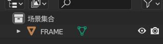
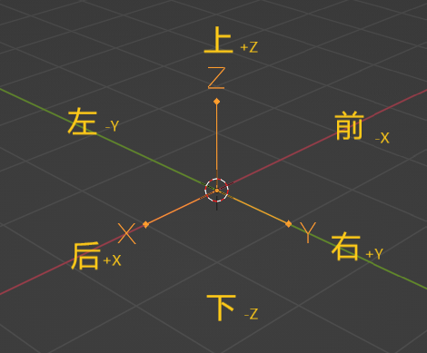

>1.什么是READOUT？
   * IR使用对象名来区分组件并控制动画，这些对象名中可被识别的语素即为READOUT。通常情况下不同的READOUT在游戏内会成为不同的零件。
    
        > [!WARNING]
        > 每个READOUT间应使用下划线分割，否则会导致识别出错。

   * 如对于车架，`FRAME`为其对应的READOUT，这意味着其对象名称至少应包含`FRAME`。
      
   * 包含相同READOUT的对象被IR认为是同一组件。
     * 比如，对于READOUT为`BOGEY_FRONT_WHEEL_[num]`的组件：
       * 名称为`BOGEY_FRONT_WHEEL_1`和`BOGEY_FRONT_WHEEL_2`的两个对象会被认为是两个组件；
       * 但名称为`BOGEY_FRONT_WHEEL_1_1`和`BOGEY_FRONT_WHEEL_1_2`的两个对象会被认为是同一组件，这经常导向轮子旋转动画不对的结果；
       * 而`BOGEY_FRONT_WHEEL1`和`BOGEY_FRONT_WHEEL2`不会被加载（不存在对应的READOUT，会被加载为没有动画的`SHELL`）。
       
         >[!NOTE]为了让它在生存模式可被制造，你的火车模型至少应该有一个`FRAME`。
   * READOUT是无序的。
   * 除READOUT外的字符均可自定义。
   * 下文约定：
     - `[pos]`不另行声明时表示前/后(FRONT或REAR)，**这是对应READOUT的一部分。**
     - `[side]`表示左/右(LEFT或RIGHT)，**这是对应READOUT的一部分。**
     - `[num]`不另行声明时表示任意不与其他同类物体重复的数字，**这是对应READOUT的一部分。**

>2.我该使用什么软件？
   * 我们通常使用blender为IR制作模型。
     * 贴图文件应与blend文件放在同一目录下。
   
       ?>不同于RTM，IR直接通过mtl文件加载贴图。
     * 对于Blender4.0+，导出时直接选择`Wavefront(.obj)`即可，记得勾选三角化。
     * 对于Blender3.6-，导出时建议选择`Wavefront(.obj)(legacy)`，其他建议同上。

     * 在资源包里，对应mtl文件和贴图应该和obj文件放在一起。     
     
       !>注意，Metasequoia无法为obj模型导出对象数据，不可用于IR追加包制作，但是可通过fbx导出模型到blender（请清除自定义拆边法向数据来获取正常的平滑渲染）。
     
   * 贴图可使用Paint.net、Substance 3d painter等。
   * 音效可使用Au，或者直接找个在线编辑器。
   * JSON可使用VS Code、notepad++等。

>3.在blender中建模有什么注意事项吗？
  * 在blender中，IR以-X方向为前，+Z方向为上，-Y方向为左，就像这样

    
  * blender中1m即为Minecraft中的一格
  * blender中，铁轨轨面/车辆轮缘的高度应为Z=0

    >[!TIP]
    >RTM则为Z=-1

  * 下文若无另行声明，则：
    * 长度指blender中X轴长度
    * 宽度指blender中Y轴长度
    * 高度指blender中Z轴长度

>4.什么是ResourceLocation？
  * [即命名空间ID](https://minecraft.fandom.com/zh/wiki/%E5%91%BD%E5%90%8D%E7%A9%BA%E9%97%B4ID)
    * IR的*命名空间*为`immersiverailroading`。
      * 下文的*ResourceLocation*应该为一串以`assets/immersiverailroading`为根目录，以`/`分割的资源包内路径。
      
        举个例子：
      
          对于ResourceLocation为`immersiverailroading:models/rolling_stock/locomotives/a1_peppercorn/a1_peppercorn.obj`的模型，
          
          其在资源包内的路径为`assets/immersiverailroading/models/rolling_stock/locomotives/a1_peppercorn/a1_peppercorn.obj`

>5.下文一些名词的定义
  * “物体”指代blender中的物体。
  * “对象”指代READOUT相同的一些物体，他们在不通过`CG`或`LCG`指定时应属于同一控制组。
  * 待补充